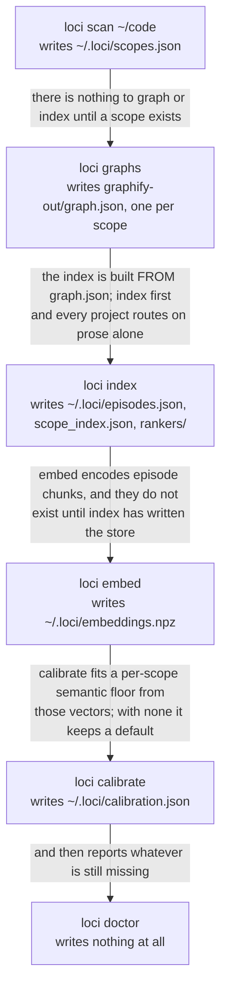
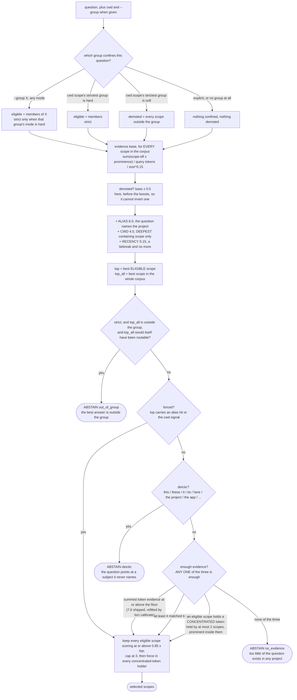

# loci

**Scoped memory for coding agents.** A router in front of two stores.

```
question ──▶ router ──▶ ┌── structure store   what calls what
             (no LLM)   └── episode store     what happened and why
                        └─▶ merged, cited answer   │
                            or ABSTAIN ────────────┘
```

Knowledge graphs hold structure but no prose, so they cannot answer *why did the
cookie get dropped*. Verbatim-recall systems hold prose but no call graphs, so
they cannot answer *what calls `run_agent_turn`*. Both make you name the
namespace when you **write**.

loci decides the scope when you **read**. One question path serves *"how does
auth work here"* and *"have I solved this in any project"* — only the size of
the scope set changes.

---

## The problem it solves

Put every project in one index and the largest one wins regardless of the
question. Measured against a merged graph of ten real repositories:

| question | on-topic nodes returned |
|---|---|
| "why was the admin session cookie dropped on localhost?" | **18%** — 19 of 31 came from the biggest project |
| "what happens when a user clicks Save as ZIM?" | **2%** — 61 of 62 came from the biggest project |
| "how does the reserved landing step work?" | 98% — and the biggest project *was* the answer |

That third row is the trap. Merged retrieval looks excellent whenever the answer
happens to live in the largest corpus and collapses when it does not. It is the
same failure in both directions, visible in only one.

---

## Install

The distribution is **`loci-mem`**; the command, the import and the project are
all `loci`. PyPI's `loci` is an unrelated outlier-detection package abandoned in
2018 — the same split as `python-dateutil` installing as `dateutil`.

```bash
pipx install loci-mem                 # routing + lexical search, ~3 small deps
pipx install 'loci-mem[all]'          # + graphify, local embeddings, MCP server
```

The base install pulls `rank-bm25`, `scikit-learn`, `numpy` and `joblib`. No
torch, no vector database, no model download unless you ask for one.

| extra | adds |
|---|---|
| `graphify` | code-symbol extraction across ~18 languages |
| `embeddings` | local `bge-small` semantic ranking |
| `rerank` | cross-encoder reranking (opt-in per query) |
| `mcp` | the MCP server |

---

## Quickstart

```bash
pipx install 'loci-mem[all]'
loci setup             # scan, graph, index, embed, calibrate -- one pass
loci ask "why was the session cookie dropped on localhost?"
```

`setup` asks only what it cannot decide for you: which directories hold your
projects, whether to register the repositories it found that are not yours, and
whether to spend a one-time model download on semantic search. It ends by
running `doctor`, so whatever it could not cover is the last thing you read
rather than something you discover from a bad answer a week later.

Every prompt takes its default when stdin is not a terminal, so it is safe to
run unattended in a container or under an agent. `-y` does the same from a
terminal, and `--no-graphs` / `--no-embed` / `--no-calibrate` decide individual
steps up front.

The same thing by hand. The order is a dependency chain, not a preference:
graphs are what the index is built from, the index writes the chunks `embed`
encodes, and `calibrate` fits its semantic floor from those vectors.

```bash
loci scan ~/code       # register every git repo it finds, one scope each
loci graphs            # optional: add code symbols (free, no model calls)
loci index             # build the routing index + episode store
loci embed             # optional: local vectors for semantic recall
loci calibrate         # optional: fit routing thresholds to your corpus
loci doctor            # what is missing, and the command that fixes it

loci ask "which projects use wrangler and D1?"
loci eval              # measure routing accuracy on YOUR corpus
```

Each step writes what the next one reads, which is what makes the order fixed
rather than preferred:



Running it out of order does not fail loudly. It produces an install that works
and quietly retrieves worse, which is the failure `doctor` exists to name.

`scan` registers one scope per git repository. It also reads who owns each
repository out of git, prints who owns what, and asks before registering the
ones that are not yours; that prompt takes its default like every other, which is to
register everything.

A monorepo can become one scope per package instead. `--split` on `loci scan` or
`loci setup` takes anything carrying `package.json`, `pyproject.toml`,
`Cargo.toml` or `go.mod` one level down; a repo-local `.loci.json` names the rest
and is honoured with or without the flag. **`--split` is off by default**, and
the reason is measured rather than cautious: a new scope's aliases include its
bare directory name, and an alias outranks your working directory (6.0 to 4.0).
On the development corpus, splitting a repository holding `glasses/` sent eight
hand-written questions about a *different* project to `Delroy/glasses` — seven of
them had routed correctly before the split, and six of the eight reverted when
the alias boost was zeroed. A Jekyll `_site/` build directory became a scope of
its own on the same run. A `.loci.json` you wrote does not have that problem: you
named those sub-projects deliberately, so you can see what they are called.

`ask` uses your working directory by default, and should. Questions that name no
project — *"how is this deployed?"*, *"how do I run the tests?"* — route
correctly **100% of the time with cwd**. Without it they are unanswerable, and
loci abstains on all of them rather than guessing. cwd is not a tiebreaker
signal here, it is the primary one.

---

## Concepts

**Scope.** One project, one namespace. A registered git repository, one package
of a monorepo (under `--split`, or named in `.loci.json`), or anything you add
explicitly. Scopes are never merged.

**Group.** An overlapping label on a scope: `me` and `vendor:<org>`, read from
git provenance; `client:acme` and anything else you assert by hand; and a
monorepo's own id, carried by every package inside it *and* by the monorepo
itself, so `--group <monorepo>` reaches the code no package claimed. A scope can
be in several, and the scope set stays flat: grouping never merges scopes or
nests one inside another.

What a group does to a question is its **mode**, and the mode answers two
different questions. Reached through your working directory, `explicit` does
nothing, `soft` (the default) multiplies every outside scope's evidence base by
0.5, and `hard` confines routing to members and abstains when the best answer is
outside. Named on the command line with `--group X`, **all three modes confine
to X's members** — the mode decides only what happens when the best answer is
outside them: `hard` abstains and says so, `soft` and `explicit` answer with the
best member anyway. Membership lives in the scope registry, mode in
`groups.json`, so a re-scan — which rewrites the registry wholesale — cannot
discard policy. Measured: `hard`
anchored on cwd fires on questions that *name* an outside project (12 of 12) and
not on questions carrying only its vocabulary (0 of 24), so in practice `--group`
and project names drive it rather than where you are standing.

**Structure store.** What calls what — symbols, files, references, traversals
with `file:line` citations. Supplied by [graphify](https://github.com/safishamsi/graphify)
through an adapter.

**Episode store.** What happened and why — README and docs, git commit bodies,
docstrings and comment blocks, and any notes you point it at. Stored verbatim,
chunked on heading boundaries, redacted before it is written.

**Router.** Decides which scopes a question belongs to, deterministically, with
no model call. Signals in order of weight: an explicit project name (6.0), the
working directory (4.0), vocabulary evidence (measured 0.1–1.5), recency (0.15).
Weight is not usefulness — cwd is the signal that carries most real questions,
because most real questions name no project at all.

**Abstention.** A first-class outcome. `ABSTAIN` means *ask the user*, not *pick
the biggest*. Both layers can refuse.

---

## Architecture

### The query path

The diagram at the top of this file is the elevator version. In full:

```
loci ask "why was the session cookie dropped on localhost?"
  │
  │   --scope NAME jumps straight past routing to the fan-out, and drops the
  │   episode gate with it: that gate exists to stop an answer arriving from
  │   the wrong scope, and you have just named the right one.
  ▼
confinement                                                       groups.py
  │   reads the registry and groups.json. Never the index, never a model.
  │     --group X  ─▶  eligible = members of X, in ALL THREE modes
  │     else cwd   ─▶  the strictest group of the scope you are standing in
  ▼
route                                                             router.py
  │   reads scope_index.json: token ─▶ {scope: node_df}. One dict lookup per
  │   query token. Deterministic, sub-millisecond, no model call.
  │
  ├──▶ ABSTAIN — deictic, no_evidence or out_of_group. Names the cause, lists
  │             the candidates, names the flag that fixes it, and queries
  │             nothing. An outcome, not an error.
  ▼
selected scopes, at most 3        one thread each; neither store is ever
  │                               queried across a scope boundary
  ├─── scope ─── scope ─── scope
  │      │
  │      │  expand the question against THIS scope's postings — a dict
  │      │  lookup, so a token the scope does not have cannot be invented —
  │      │  then append the tokens of its nearest embedded symbol labels
  │      │
  │      ├─ structure store   graphify query --graph <this scope's graph>
  │      │                    what calls what, with file:line citations
  │      │
  │      └─ episode store     BM25 + char 3–5 gram + embeddings, fused
  │                           gated: lexically grounded OR semantically
  │                           confident, so it can return nothing, and does
  ▼
merged, cited answer — one block per scope, and `no evidence in this scope`
wherever both of a scope's stores came back empty
```

Both stages refuse independently: the router can decline to pick a scope at
all, and a scope it did pick can still hand back nothing.

### The routing decision

Everything above the fan-out is one function. It scores every scope in the
corpus, then asks three refusal questions in a fixed order. An alias or cwd
signal skips the last two, but not the first.



Three things in that shape are load-bearing and none of them are obvious.

**`forced` is an escape, not a signal.** An alias hit or a cwd hit contributes
nothing to either evidence count, so a scope winning purely on 6.0 or 4.0 reads
as zero evidence to the gates below. It skips both of them instead: deixis is
only a problem when nothing else has identified the subject, so a question that
says "it" *and* names a project is unaffected.

**`out_of_group` is judged against the whole corpus, not the group.** It fires
only when the corpus-wide winner is outside the group *and* would itself have
routed. Without that second test it swallowed the other two reasons entirely —
on a question matching no vocabulary, every scope scores near zero and the
winner is whoever took the 0.15 recency tiebreak.

**The three evidence gates are OR'd because they fail on different question
shapes.** A short question about a rare symbol has high evidence and a low
count; a long question about a familiar subsystem has the reverse. Requiring
all three abstains on both.

### Scopes and groups

Groups are overlapping labels over a flat scope set. There is no tree anywhere,
and nothing is ever merged.

```
      scope                        the groups it carries
      ───────────────────────────  ──────────────────────────────────────
      delroy           monorepo    me    delroy
      delroy/glasses   sub-scope   me    delroy
      delroy/client    sub-scope   me    delroy   client:acme
      acme-api         repo        me             client:acme
      vendorlib        repo                                     vendor:someorg

      me, vendor:someorg   read from git provenance by `scan` or `groups infer`
      delroy               computed by `scan` from the filesystem: a repository
                           that splits gives its own id to every sub-project
                           inside it, and to itself
      client:acme          asserted by hand, with `loci group add`
```

Five scopes, four groups. `delroy/glasses` is not stored *inside* `delroy`; it
carries the label `delroy` exactly as it carries `me`. `client:acme` spans a
monorepo sub-project and an unrelated repository, which a hierarchy could not
express at all. The two sub-scopes exist only because that repository declared
them in `.loci.json`, or was scanned with `--split`; without either, `delroy` is
one scope and the containment group does not exist. A parent excludes its
sub-scopes' subtrees from its own collection, so no file is counted twice and
neither vocabulary is inflated with the other's tokens.

What a group does to a question is its **mode**, and the mode answers two
different questions depending on how the group was reached:

```
                    reached through your cwd        named with --group X
  ────────────────  ─────────────────────────────   ────────────────────────
  explicit          nothing                         confines to X's members
  soft (default)    every outside scope's           confines to X's members
                    evidence base × 0.5
  hard              confines to members, and        confines to X's members,
                    abstains when the best          and abstains when the
                    answer is outside               best answer is outside
```

The right-hand column is the counter-intuitive half, so it is measured rather
than asserted. On a three-scope fixture — `alpha` and `beta` in group `team`,
`vend` outside it — one question, four policies:

```
loci route "how does the gizmo parser emitter handle sprocket calibration"

  unconfined                  -> vend, alpha
  --group team   explicit     -> alpha
  --group team   soft         -> alpha
  --group team   hard         -> ABSTAIN (out_of_group); candidates: alpha, beta
```

All three modes dropped `vend`, the scope that won unconfined. `--group` is you
asserting the answer is in here; the mode decides only what happens when it is
not.

Reached through cwd instead, `soft` demotes and does not confine. The same
question asked from inside `alpha` with no `--group` at all returns
`alpha, vend`: `vend` scores 3.39 against `alpha`'s 6.18 — far outside the
0.85 widening band — and comes back regardless, because it is the sole holder
of `gizmo`, `parser` and `emitter`, and the concentrated tier forces every
holder of a shared-or-rare term into the answer. Demoted is not excluded.

---

## Commands

| command | purpose |
|---|---|
| `loci setup [dirs…]` | scan, graph, index, embed and calibrate in one pass (`-y`, `--no-embed`, `--split`) |
| `loci update [dirs…]` | refresh graphs, index, vectors and calibration for what is registered (`--no-scan`, `--force`) |
| `loci scan <dirs>` | discover git repos and register them as scopes (`--split`) |
| `loci add <path>` | register one scope explicitly (`--alias`, `--glob`) |
| `loci scopes` | list what is registered (`--group`) |
| `loci groups` | list groups, their resolved mode, and how many are in each |
| `loci groups infer` | label every scope `me` or `vendor:<org>` from git provenance |
| `loci group set <group> --mode` | how much a group confines: `explicit`, `soft`, `hard` |
| `loci group add\|rm <scope> <group>` | edit one scope's membership |
| `loci graphs [scope…]` | build missing structure graphs via graphify |
| `loci index` | build the routing index and episode store (`--force`) |
| `loci embed` | encode episode chunks locally (`--model`) |
| `loci calibrate` | fit the evidence floor to your corpus (`--show`) |
| `loci route "…"` | show where a question routes (`--explain`, `--group`) |
| `loci ask "…"` | route, then query both stores (`--scope`, `--group`, `--fast`, `--rerank`) |
| `loci doctor` | coverage gaps per scope, and the fix for each |
| `loci eval` | measure routing on your corpus (`--misses`) |
| `loci skill install` | install the `/loci` skill for an AI client (`--dir`, `--print`) |
| `loci mcp` | run the MCP server on stdio |

`loci index` reuses any scope whose files and git HEAD are unchanged, so
reindexing is cheap enough to run from a commit hook.

### Keeping it current

Nothing updates itself. There is no watcher, no daemon and no installed git
hook: every refresh is a command you run.

```bash
loci update            # the whole chain, for everything registered
```

It is `setup` for an install that already exists, so it prompts for nothing and
opts you into nothing new: embeddings are re-encoded because you already had
embeddings, and the thresholds are refitted because they were already fitted.
It also rescans wherever your last scan was pointed, so a repository created
since then is registered rather than missed — that is what the `roots` key in
`scopes.json` is for, and `loci update ~/work` adds another.

The one thing it rebuilds unconditionally is the **structure graph**, because
that is the only staleness in loci that is otherwise silent. `loci graphs`
builds a graph that is *missing* and skips every scope that already has one, so
a project whose code moved keeps routing on the symbols it had the day it was
registered. Everything else announces itself: `index` re-parses a scope whose
fingerprint moved, and `doctor` names embeddings that no longer line up with
the store. Rebuilding all of them is affordable because graphify does not
rewrite a graph whose code did not change — measured, a second consecutive run
left `graph.json` byte-identical with its mtime untouched, and loci's own
fingerprint reads that mtime, so refreshing the graphs does not force a reindex
of the scopes that stood still.

By hand, the same thing, and the order is the dependency chain again:

```bash
loci graphs --all      # `loci graphs` alone would skip every existing graph
loci index             # unchanged scopes are reused, not re-parsed
loci embed             # a full re-encode; skipping it silently disables
                       # semantic search for every scope whose chunk count moved
loci calibrate         # the floor measures shared vocabulary, which just changed
```

Two things `update` cannot do for you. A project deleted from disk stays in the
registry — it is reported, not removed, because the entry carries groups and
aliases you set by hand and the directory may only be unmounted. And a
long-running `loci mcp` server holds its fitted rankers and vectors in memory
from boot, so restart it after a rebuild.

---

## From inside an AI client

```bash
loci skill install          # -> ~/.claude/skills/loci/SKILL.md
```

That installs one skill with subcommands, not eight commands cluttering the
listing:

```
/loci "<question>"          ask memory; routes on your working directory
/loci update                refresh everything registered
/loci doctor                coverage gaps per project, and the fix for each
/loci scopes                what is registered, and the group each is in
/loci route "<question>"    where a question routes, and why it abstained
/loci add <path>            register one project
/loci setup [dirs…]         first run
/loci <anything else>       passed through to the `loci` CLI verbatim
```

The passthrough rule is what keeps it short: `index`, `embed`, `graphs`,
`calibrate`, `eval` and `groups` all work from the client without being
documented twice, so the skill cannot drift from flags it never mentions. What
it *does* mention is checked — a test parses the Usage block and fails if any
command in it stops existing.

The skill ships inside the package rather than in a dotfiles repo, because it
documents flags and abstention reasons that the CLI can change; `loci skill
install` after an upgrade is the whole update path. `--print` writes it to
stdout for a client that does not read `~/.claude/skills`.

Two things it teaches an agent that are not obvious from the CLI. **Run it from
the project root** — cwd is the primary routing signal, so a question asked from
the wrong directory routes worse than one asked from none. And **`ABSTAINED` is
an answer**: the reason names what to do next, and an agent that rephrases and
retries instead is burning turns on a decision that was about vocabulary rather
than wording.

---

## MCP

```bash
loci mcp
```

Three tools — `ask`, `scopes`, `doctor` — not several dozen. Agents are the
primary consumer, and a wide tool surface pushes orchestration onto the model
and burns a turn per hop.

Pass `cwd` to `ask` whenever the client knows it, and `group` to narrow the same
way `--group` does on the command line. The server loads the embedding model and
the largest scopes' rankers at boot, so the first tool call an agent makes is
fast rather than paying ~4.4s of startup while the user waits.

---

## Measure it on your own corpus

Every accuracy figure below was fitted and measured against one person's ten
repositories. That is a claim you would otherwise have to take on trust.

```bash
loci eval            # a few seconds, no labelling, no setup
loci eval --misses   # and what it got wrong
```

It only asks questions whose correct answer is known by construction:

| family | how gold is known |
|---|---|
| deictic + cwd | asked from inside a scope, so the answer is that scope |
| deictic, no cwd | nothing says which project — abstaining is the only correct answer |
| unanswerable | nonsense no software corpus can answer |
| signature | built from each scope's own most distinctive vocabulary |

```
10 scopes | random guessing would score 10.0%

family                  n  correct  scopes  what it measures
deictic + cwd          80  100.0%       -   should route to the scope you are in
deictic, no cwd         8  100.0%       -   should abstain; nothing says which project
unanswerable            6  100.0%       -   should abstain; no corpus can answer these
signature              20  100.0%     1.0   are your scopes distinguishable from each other?
```

The signature family is an **upper bound** — it asks each scope about its own
rarest words, so a real question phrased in shared vocabulary does worse. A low
score there is a fact about your projects, not necessarily a bug to tune away.

### Calibration

Routing gates on three independent signals, and **any one passing is enough**:
one exceptionally discriminative token, enough summed token evidence, or enough
matched tokens. They fail on different question shapes — a short question about
a rare symbol has high evidence and a low count, a long question about a
familiar subsystem has the reverse — so requiring all three abstains on both.

The evidence floor is the one that depends on your corpus, because it depends on
how much vocabulary your projects share. `loci calibrate` fits it from the same
auto-labelled questions, and reports whether the bands separate at all:

```
evidence floor      7.17
fitted from         149 routable + 14 unroutable questions, none hand-labelled
classifies          84.0% of its own samples correctly

! The bands OVERLAP -- some questions that should route score no higher than
  questions that should not, so no threshold separates them cleanly.
```

An overlap warning is information about your projects, not a defect: they share
enough vocabulary that evidence alone cannot always tell them apart, and cwd or
`--scope` should carry more of the weight.

---

## What it reads, and what it writes

Everything stays on your machine. No LLM in the query path; routing is a dict
lookup per token. Embeddings, when enabled, run locally.

Collected per scope: `README*`, `docs/**/*.md`, source files (for docstrings and
comment blocks), and `git log`. Add anything else with `loci add --glob`,
including absolute paths outside the repo.

The only configuration loci reads from inside a repository is `.loci.json`, and
only if you write it. It names sub-projects at any depth, and unlike
`--split` it is honoured on every scan:

```json
{"scopes": [{"path": "client"}, {"path": "services/api"}]}
```

Paths are relative to the repository root and may not escape it. A malformed
file is ignored — a scan that aborts on a stray comma is worse than one that
misses a declaration. Nothing writes this file; you do.

The only thing loci ever puts inside a repository is `graphify-out/graph.json`.
Two commands write it: `loci graphs`, which does nothing else, and `loci setup`,
which offers it at step 2 of 5 and takes yes as the default — including with no
terminal, where every prompt takes its default. `loci setup --no-graphs` skips
it, and every other command reads.

So inside a repository exactly two files matter, and they point in opposite
directions:

```
<repo>/graphify-out/graph.json    loci writes it, on request. You never do.
<repo>/.loci.json                 you write it. loci never does.
```

Everything else goes to `~/.loci` (or `$LOCI_HOME`). One directory, not one per
project: routing is a cross-scope decision, so answering *which project is this
about* needs every scope's vocabulary in the same lookup, and N per-project
indexes would turn the cheap question into the expensive one.

```
~/.loci/                    what it holds               written by

├── scopes.json             the scope registry, and     scan, add, group,
│                           the roots it was scanned    update
│                           from, for `loci update`
├── groups.json             group policy: default mode  group set
│                           and any mode set per group
├── scope_index.json        routing index, the token    index
│                           -> {scope: node_df} map
├── episodes.json           the episode store: chunks   index
│                           verbatim, already redacted
├── rankers/<scope>.joblib  fitted BM25 + char-gram     index
├── embeddings.npz          chunk and symbol vectors    embed
├── .symbols-<scope>.json   symbol labels, in the       embed
│                           order embeddings.npz has
├── calibration.json        the fitted evidence floor   calibrate
│                           + a semantic floor / scope
└── .index.lock             advisory build locks, so    index, embed
    .embed.lock             two builds cannot inter-
                            leave their writes
```

`scopes.json` is machine-managed and rewritten wholesale by every scan;
`groups.json` is yours and must survive one. That is why membership lives in the
registry and mode lives in the policy, and why they are two files.

### Redaction

Everything collected passes through `loci.redact` **before** it is written, so a
credential committed by accident never reaches the episode store, the vectors or
the rankers.

Files that exist to hold secrets are never opened — `.env*`, `.dev.vars`,
`*.pem`, `*.key`, `id_rsa`, `secrets.*`, `credentials.json`. Then every chunk is
scanned for AWS keys, GitHub/Slack/Google/Stripe/OpenAI/Anthropic tokens,
private-key blocks, JWTs, `user:password@host` connection strings, bearer
tokens, and long opaque values assigned to a secret-shaped name.

Chunks are built through a single constructor, so a new collection path cannot
forget to redact. A secret assignment keeps its key name and loses only its
value, so the chunk still reads sensibly and still routes:

```
client_secret = "aVeryLong..."   ->   client_secret = "[REDACTED:secret-assignment]"
```

`loci index` reports what it removed, per scope and by kind — silent redaction
is indistinguishable from none. Deliberately biased toward over-redaction: a
false positive costs one chunk a little retrieval quality, a false negative
copies a live credential into a plaintext file and a vector index.

---

## Design rules, and the measurements behind them

Each of these is something a reasonable implementation gets wrong.

**1. Never merge scopes into one index.** See the table at the top: 2% and 18%
on-topic against a merged graph.

**2. Abstention is a feature at both layers.** Measured 10/10 on probes
including deliberate nonsense. Every RAG tool confidently answers "what is the
airspeed velocity of an unladen swallow"; this one says it does not know.

**3. Margin and ratio tests do not measure confidence.** Both were tried and
both invert on real data. *"How do I fix this bug?"* produces routing margin
0.94 while a correctly-routed question produces 0.18. Nonsense scored 0.608
against a large scope with a **higher** top-to-p90 ratio than a genuine question
against a small one. What separates them is whether the question's words exist
in the corpus at all.

**4. A matched-token count is not evidence.** Compared against auto-labelled
questions, count does not separate routable from unroutable at all — it inverts.
Summed token evidence does. Count is kept only as one of three OR'd gates.

**5. Deixis is grammatical, so detect it grammatically.** A question that points
at its subject ("this project", "the app", "it") cannot be routed by vocabulary,
because the words that would identify the subject are exactly the ones it
declines to say. No lexical statistic rescues this: per-token evidence for
`start` (2.51) and `services` (2.56) is indistinguishable from real evidence
like `session` (2.53). A closed class of markers took abstention from 37.5% to
100%.

**6. Normalize for scope size, twice.** With one scope 67× larger, ordinary
English words appear in exactly one scope and score as maximally discriminative
for it.

**7. Docstrings are excellent retrieval material and poor routing material.**
They are high-volume generic English — "returns", "the value", "default",
"configuration" — and folding them into routing halved accuracy on both a
symbol-indexed and a prose-only corpus.

**8. Coverage is the binding constraint, not ranking.** This surfaced in every
experiment. Running a free AST-only index over three un-indexed repos moved
routing 69.6% → 82.6% *while adding two more scopes to compete against*. Hence
`doctor` as a first-class command: an empty answer with a reason beats a
confident answer from the wrong project.

---

## Ranking

Episode search fuses three signals, renormalizing over whichever produced one:

| ranker | catches |
|---|---|
| BM25 | exact terminology, rare identifiers |
| char 3–5 grams | morphology and casing — `samesite` vs `SameSite=None` |
| embeddings (bge-small, local, optional) | meaning without shared words |

The lexical pair recovers questions the structure graph cannot see at all. The
embedding ranker covers what neither lexical ranker can: a question and its
answer that share no vocabulary.

Adding embeddings destroyed abstention — every chunk gets a nonzero score, so an
absolute floor stops firing. The fix is a **two-tier gate**: a hit must be
lexically grounded *or* semantically confident, because a lexical gate alone
rejects exactly what embeddings were added for.

Cross-encoder reranking is available via `--rerank` and **off by default**: it
measured 2/6 → 3/6 precision@1 at ~96ms/query with two small regressions, on six
cases whose labels are themselves arguable.

---

## Performance

```
loci index          15s full · 3.9s when nothing changed
loci ask            1.0s one-shot with --fast · ~5s with semantic ranking
MCP server          6s at boot, then 0.2-0.3s per tool call
routing             sub-millisecond, and flat from 25 to 100 scopes
```

Three things make that work, each a measured bottleneck first:

**Traversal prunes, it does not filter.** `Path.glob("**/*.py")` descends into
`node_modules`, `.venv` and `Pods` in full — 32.9s to enumerate one repo. It
improves the index as well as the clock: one project was 66% vendored
third-party source before pruning.

**Lexical rankers are fitted at index time.** Char 3–5 gram TF-IDF over a large
scope costs ~1.5s, and an in-process cache never survives a CLI or MCP
invocation.

**The embedding model is loaded at MCP boot.** ~2.3s of imports plus model
construction is process startup, not work. `--fast` skips it for one-shot CLI
questions.

### Scale

| scopes | vocabulary overlap | routing | top-1 |
|---|---|---|---|
| 25–100 | low | 0.1–0.5ms | **100%** |
| 25–100 | moderate | 0.3–0.6ms | 90% |
| 25 | high | 0.1ms | 36% — answers, and is usually wrong |
| 50–100 | high | 0.5ms | abstains 90% of the time |

Scope count is not the limit; vocabulary overlap is. The failure gets *safer* as
scope count rises — more scopes sharing a term means less evidence for any one,
and the gate fires. A **small** corpus of highly similar projects is the
dangerous configuration.

---

## Durability

Writes go through a temp file and `os.replace`, so a reader never sees a
half-written index. `Path.write_text` truncates before it fills: measured on an
8MB store, **11 torn reads** in a few seconds of concurrent access, and 0 after
the change. An MCP server reading while `loci index` runs sat squarely in that
window.

`loci index` and `loci embed` hold an advisory lock, so two builds refuse to
interleave rather than producing an index and a store that disagree. Locks left
by a dead process are detected and broken.

The store is written before the index, because the index is what readers gate
on: a crash between the two leaves a stale index pointing into a store that is a
superset of it, never an index promising chunks that do not exist.

---

## Extending

Two contracts in `backends/base.py`:

```python
class StructureBackend(Protocol):
    def sources(self, scope) -> list[dict]: ...
    def vocabulary(self, scope) -> Counter: ...      # feeds the router
    def query(self, scope, query, *, budget, dfs) -> list[StructureHit]: ...

class EpisodeBackend(Protocol):
    def collect(self, scope) -> list[Chunk]: ...      # verbatim, redacted
    def search(self, question, chunks, scope_id, *, k, rerank) -> list[EpisodeHit]: ...
```

Nothing above `backends/` knows which implementation is in use. Swapping
graphify for tree-sitter, SCIP or an LSP index means writing one adapter, not
editing the router. `search` **must** be able to return an empty list — a store
that always finds something cannot be trusted when it does.

### Why it is not a graphify fork

loci depends on graphify through one adapter that reads its `graph.json` data
contract and shells out to `graphify query --graph`. Forking would mean
inheriting a 767KB extractor and ~18 tree-sitter grammars to change code that
never needed changing. The scoping gap that motivated loci — graphify tags
merged-graph nodes with a `repo` attribute and exposes no way to filter on it —
is solved *above* graphify by keeping one graph per scope. Both projects are
MIT, so forking stays available; it just is not necessary.

---

## Status

Alpha, and the numbers deserve their caveats.

Measured on a 105-item set over 10 scopes — see `evals/RESULTS.md` for method,
per-family results, and the things that were tried and rejected. 80 of those
items are generated from a fixed taxonomy applied to every scope, so that
portion is unbiased by construction. The remaining 25 were hand-authored by the
same person who built the router; each carries a `contamination` field recording
what the author had seen, and uncontaminated results are always reported
separately.

**Known limits:**

- Uncontaminated top-1 is 85.7% — that is 6 of 7 items. Single items move the
  number 14 points.
- The structure store surfaces the answering symbol in 4 of 7 probes.
- Large prose-only scopes over-attract; a scope with thousands of chunks and no
  code graph absorbs questions belonging elsewhere.
- Never executed on Linux or Windows. Two platform bugs were found and fixed by
  reading, which is evidence that reading finds bugs — not that it finds all.
- `loci eval` and `loci calibrate` share question families, so a perfect `eval`
  score immediately after calibrating is partly circular.

The most useful thing anyone can do is run `loci eval` on a corpus that is not
mine and say what it reports.

---

## License

MIT.
